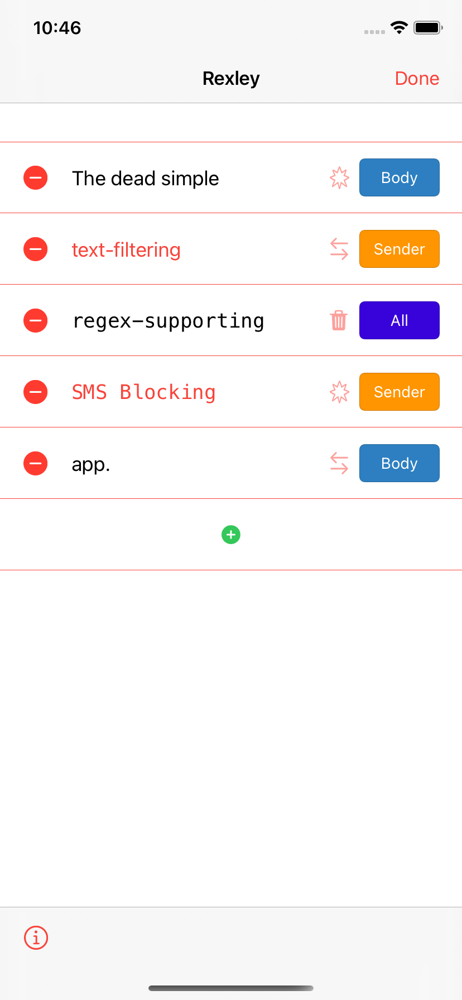
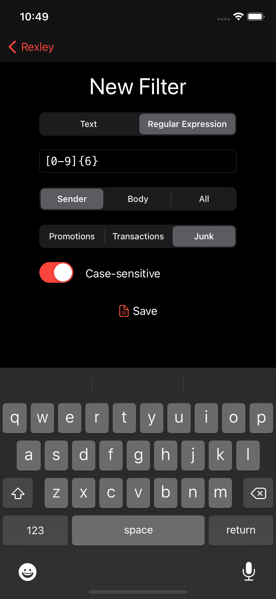

Rexley is no longer available on the App Store for the following reasons:

1. I made this primarily for my own consumption and there's really no ROI on working on it any further. It's really quite ugly but it does what I need it to.
2. The App Store is quite honestly a hassle to work with on a level no one ever warns you about. There's a ton of legal nonsense that Apple just assumes you have a lawyer to talk to about. You have to send a declaration to some US agency every year if you use cryptography, which I would have to do should Rexley ever add any feature that uses HTTPS, i.e., literally any feature that connects to the internet, and said declaration is ridiculously poorly documented and far too big of a liability for me to risk over such a silly simple app.

If you want to fork this or straight up build it and publish it on the App Store, be my guest. I'd ask you to keep it open source but, it's the MIT License so you can do whatever the hell you damn please really.

---
# 🦖 Rexley

Rexley is a free, dead simple Text or Regular Expression-based SMS filter for iPhone and iPad.

I made this app mostly for fun, but also because I needed something like it and all the available options were proprietary and/or overkill.

The idea is to have a privacy-respecting SMS filtering app that relies solely on your input, and one that is open source/source available so you can freely audit the code, and be positively sure that your data stays on your phone.

Rexley supports either text-based or regular expression based filters: you can filter out text you don't like from an SMS or utilize the full power of regular expressions to junk those pesky four-digit-number shortcode ads with reckless abandon.

# Screenshots

# 📱 Supported Devices
Rexley requires an iPhone or iPad running iOS 14.0 or iPadOS 14.0.

# ⚖️ Licensing Info
The application as received via the App Store for end users is licensed under the [Licensed Application User License Agreement](http://www.apple.com/legal/internet-services/itunes/appstore/dev/stdeula/).

The source code is available under the MIT License. See 'License' for a local copy.

Rexley relies on a number of awesome third party libraries. Their copyright notices are in 'OSAcknowledgments.txt'.
