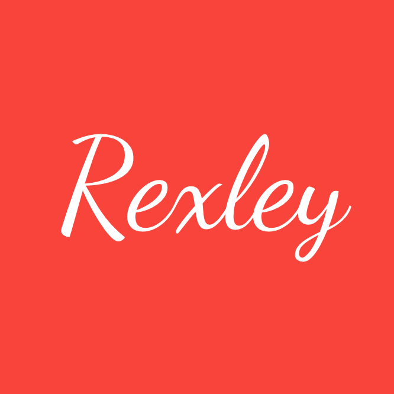
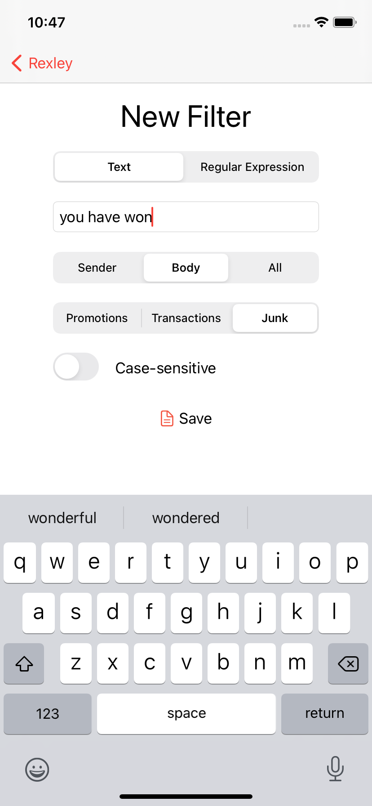

# 
 

Rexley is a free, dead simple Text or Regular Expression-based SMS filter for iPhone and iPad.

I made this app mostly for fun, but also because I needed something like it and all the available options were proprietary and/or overkill.

The idea is to have a privacy-respecting SMS filtering app that relies solely on your input, and one that is open source/source available so you can freely audit the code, and be positively sure that your data stays on your phone.

Rexley supports either text-based or regular expression based filters: you can filter out text you don't like from an SMS or utilize the full power of regular expressions to junk those pesky four-digit-number shortcode ads with reckless abandon.

# Screenshots

# 📱 Supported Devices
Rexley requires an iPhone or iPad running iOS 14.0 or iPadOS 14.0.

# ⚖️ Licensing Info
The application as received via the App Store for end users is licensed under the [Licensed Application User License Agreement](http://www.apple.com/legal/internet-services/itunes/appstore/dev/stdeula/).

The source code is available for inspection or private deployment under the [GNU General Public License, v3](https://www.gnu.org/licenses/gpl-3.0.txt). See 'License' for a local copy. Please note the GPL does not apply to the App Store copy as the two license agreements are in conflict.

Rexley relies on a number of awesome third party libraries. Their copyright notices are in 'OSAcknowledgments.txt'.
